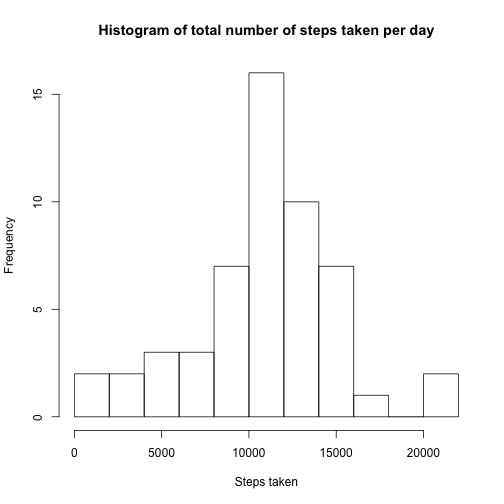
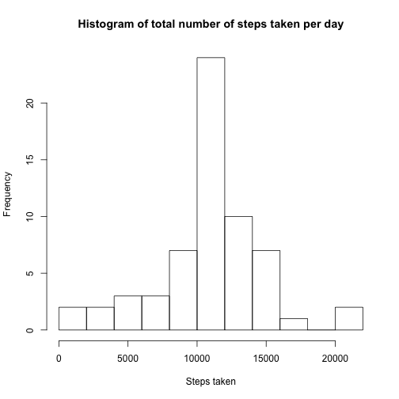
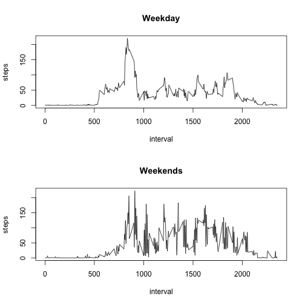

# Peer Reviewed Assignment 1 
## Loading and preprocessing the data 
Loading the downloaded data using read.csv command. 

```r
data<-read.csv("~/Desktop/MACHINELEARING/Coursera/ReproducibleResearch/activity.csv", header=TRUE)
```

Calculating the number of 5 minute intervals in a day 

```r
frequencyR=24*60/5
daysteps<-aggregate(ts(data[, 1], freq=frequencyR), 1, sum)
```
##Removing the NAs and calculating the mean and median

Removing the NAs from the dataset and obtaining 'daysteps1', which is the total number of steps taken per day.  

```r
data1<-na.omit(data)
daysteps1<-aggregate(ts(data1[,1],freq=frequencyR), 1, sum)
```

Plotting the histogram with 10 breaks. 

```r
hist(daysteps1, breaks=10, main="Histogram of total number of steps taken per day", xlab="Steps taken")
```

 

The mean and median of the total number of steps taken per day

```r
mean(daysteps1)
```

```
## [1] 10766.19
```

```r
median(daysteps1)
```

```
## [1] 10765
```


The mean and the median of the total number of steps taken per day are 1.0766189 &times; 10<sup>4</sup> and 10765, repectively. 

##Average daily activity pattern 
To obtain the mean steps taken from the data1 datasets for the same interval throughout the observations. The mean steps taken is then plotted along y axis for each 5 minute interval.  

```r
plot(aggregate(steps~interval,data=data1, mean), type="l")
```

 

Obtaining the 5 minute, on average across the dataset with the maximum number of steps.  This is obatinined using the Which and max function. 

```r
num<-aggregate(steps~interval, data=data1, mean)
num$interval[(which(num[2]==max(num[2])))]
```

```
## [1] 835
```

##Inputing missing data 
### counting number of missing data

```r
NAsinData=sum(is.na(data))
NAsinData
```

```
## [1] 2304
```
- The total number of NAs in the data set is 2304

### filling the missing data 

The statergy adopted to fill in missing data is using the mean for that 5-minuate ineterval exculding the NAs. For this, mean is calculated for each 5 minute bin in the given data.


`{r} num` provides mean values for each interval excluding the NAs. 

We creating a subset dataset only for the missing days using is.na and store it to missing data. The fact that whole day of data is missing is utilised to replace the data in those with the mean data, for the missing days is calculated (mis_days). steps is repeated for as may days, in this case 8 days; and then a new data frame is created with the subset missing data (date and interval) and mean steps taken. 

```r
Misdat<-subset(data, is.na(data$steps))
mis_day<-nrow(Misdat)/frequencyR
Misdat1<-Misdat[, c("date","interval")]
steps<-rep(num[,2], times=mis_day)
new.data<-data.frame(steps, Misdat1)
```

First, I obtain a data omitted, where all NA values rows are discarded and joined with new.data, which is exclusively made of data that is missing.  Utilising the join function a new data fram is created which has replaced the NAs values.  

```r
data12<-na.omit(data)
library(plyr)
datafix<-join(data12, new.data, type="full")
```

```
## Joining by: steps, date, interval
```

Histogram of total number of steps taken per day. The procedure is similar to that adopted earlier in obtaining the histogram, median and mean

```r
daysteps2<-aggregate(ts(datafix[,1],freq=frequencyR), 1, sum)

hist(daysteps2, breaks=10, main="Histogram of total number of steps taken per day", xlab="Steps taken")
```

 

```r
mean(daysteps2)
```

```
## [1] 10766.19
```

```r
median(daysteps2)
```

```
## [1] 10766.19
```

The mean and the median of the total number of steps taken per day are 1.0766189 &times; 10<sup>4</sup> and 1.0766189 &times; 10<sup>4</sup>, repectively. 

The mean obtained by missing values remains the same as earlier when NAs were not conisdered. The median value has changed and is higher than the first assignment. Now both median and mean are the same. value. imputting missing values had no effect on total numbe of steps taken on each day. This was expected as the approach was to developed using the mean value. The median of the population is higher, as the 8 days of data added has maginally increased the median value. 

##Difference in behavior over Weekdays and Weekends

For this, the data is split into two using the weekdays() function as weel as the as.Date. The saturday or sunday is matched to the condition to obtain and Weekends from the datafix and similar the days that are not saturday or sunday are subsetted into Weekdays. 

```r
Weekday<-datafix[weekdays(as.Date(datafix$date))!=c("Saturday", "Sunday"), ]
Weekend<-datafix[weekdays(as.Date(datafix$date))==c("Saturday", "Sunday"), ]
```
For Plotting, The base plotting function is create two planels. The top panel is walking pattern for Weekday and bottom planel is for weekends. 


```r
par(mfrow=c(2,1))
plot(aggregate(steps~interval, data=Weekday, mean), type="l", main="Weekday")

plot(aggregate(steps~interval, data=Weekend, mean), type="l", main="Weekends")
```

 

